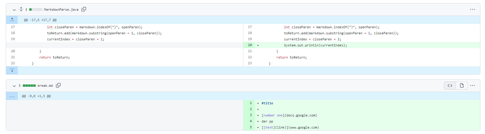

# Laboratory Report Numero Dos
## Code Change the first 
---

[the commit](https://github.com/MochaCoral/markdown-parse/commit/2af026d7e54d063a6de8051979c4960c52084dba)



In the following commit I created the markdown file `break.md`, which was mean to be test case regarding the use of abnormal behaviors, and in this file, I added the following lines after the title header:
```
[number one](docs.google.com)
der pp
[[text](link)](www.google.com)
```

The first line is meant to be a test in a case where the parser is working correctly, in which case we know that it would work properly using in this circumstance.

The second line is meant to test the circumstance of a non link in a markdown file, which for working behavior, the parser would overlook and find the next link after that. 

The last line is an edge case where there 