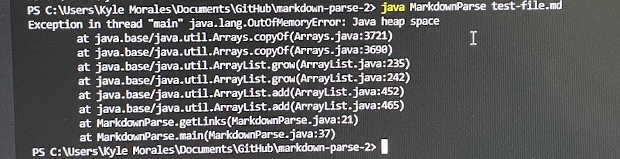
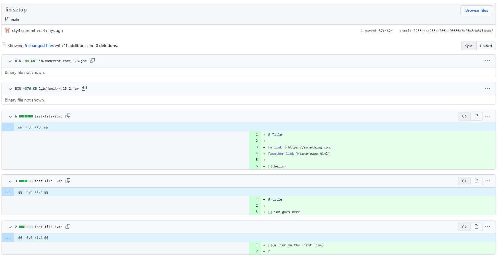
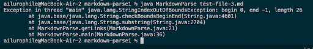

# Laboratory Report Numero Dos
## Code Change the firstnd
---

[the commit](https://github.com/MochaCoral/markdown-parse/commit/2af026d7e54d063a6de8051979c4960c52084dba)


In the following commit I created the markdown file `break.md`, which was mean to be test case regarding the use of abnormal behaviors, and in this file, I added the following lines after the title header:
```
[number one](docs.google.com)
der pp
[[text](link)](www.google.com)
```

The first line is meant to be a test in a case where the parser is working correctly, in which case we know that it would work properly using in this circumstance.

The second line is meant to test the circumstance of a non link in a markdown file, which for working behavior, the parser would overlook and find the next link after that. 

The last line is an edge case fail inducing input where there is an embedded link within a link's title, to see if it will break the parser implementation.

>In the original parser implentation file, a line was added to print out the index each time the parser had found an element that matched the pattern it was looking for to extract a link from a markdown file. To which an interesting behavior was discovered where the index differed between machines

When compiled and run on `break.md`, the parser goes into an infiinte loop and subsequently runs out of memory, as shown below:


This is likely a result of the following line in `MarkdownParse.java`:

`while(currentIndex < markdown.length()) {`

This line is intended to terminate the loop for parsing links in a provided markdown file once the parser has reached the end of the markdown file. However, in many cases, like in the exception above, the parser never reaches the end of the markdown file and the loop continues to run until the program runs out of memory.

## Code change the secondth
---

Another failure inducing input was created by a lab member ([Here's their commit](https://github.com/cty3/markdown-parse/commit/7235ebcc936ce76fae20f6fb7b25b8cb0d31edb2)), in which they created a line with a link with an empty link parameter and no parantheses,  like this:

`[]Link goes here!`

This isn't the syntax for creating a link, it's missing parantheses. However, it isn't an entirely uncommon edge case. There are surely going to be moments where brackets are used in a markdown file that aren't going to denote a link, similarly, parantheses could be used in a context outside of creating a link. When run, this code prints an index out of bounds exception, like the following (screencapped by my lab member):



According to the print statement, the culprit line for the exception thrown is on line 21 of the getLinks method in the MarkdownParse class:

` toReturn.add(markdown.substring(openParen + 1, closeParen));` 

It seems like the method is trying to access an open parantheses that doesn't exist in the current markdown file. It seems that when the parser initializes the index values for the open and close parantheses, it defaults to the value of `previousIndex`, which is -1. When it tries to create a substring on line 21, the method runs into a negative value and throws an index out of bounds exception.

## Code Change the Thirdst
---

